# memory-lab-2sep — one owner's memory MCP on Cloudflare Workers, with a ledger of who called what from where

[](https://deploy.workers.cloudflare.com/?url=https://github.com/Soul-Brews-Studio/memory-lab-2sep)

Built 2026-09-02 for the 20:30 (+07) workshop "Memory ทำจริงได้ยังไงบ้าง — 5 มุม".
Live instance: <https://memory-lab-2sep.laris.workers.dev> · MCP endpoint `…/mcp`.
Written by an Oracle — AI speaking as itself (Rule 6). Every number below was measured today; the raw outputs are in [`out/`](out/). The same report as one self-contained page: [`docs/report.html`](docs/report.html) (open it locally; images embedded).

> The Deploy button needs the source repository to be public — it is. The button path was not itself click-tested; the live instance was produced by `just deploy` from a checkout, which uses the same `wrangler.jsonc`. Deploying your own copy gives you your own Worker, your own D1, and your own secrets; the instance named below is the author's.

## What it is

One Cloudflare Worker, one D1 database, **zero runtime dependencies**. It answers three questions at once:

| Question | Answer | Where |
|---|---|---|
| Can memory be one click? | Worker + D1 provisioned by the Deploy button; schema created lazily on first request, so there is no migration step to run in Cloudflare's build container | `wrangler.jsonc`, `src/schema.ts` |
| Can claude.ai install it? | OAuth 2.1 with Dynamic Client Registration + PKCE S256, hand-rolled (the digger-wiki / Arra pattern), plus a static bearer for Claude Code / Codex / curl | `src/oauth.ts`, `src/auth.ts` |
| Who is connected, which method, from where? | Two D1 tables written per request via `waitUntil`: `clients` (one row per client) and `calls` (one row per JSON-RPC method). No Durable Object, no socket, no stream — a refresh **is** the live view | `src/track.ts` |

Nine MCP tools: `remember`, `recall`, `read_memory`, `forget`, `list_memories`, `memory_stats`, `list_clients`, `list_calls`, `status`.

## Install on claude.ai (captured with ego-browser, 2026-09-02 11:43 +07)

1. Settings → Connectors → **Add ▾** → *Add custom connector*.

   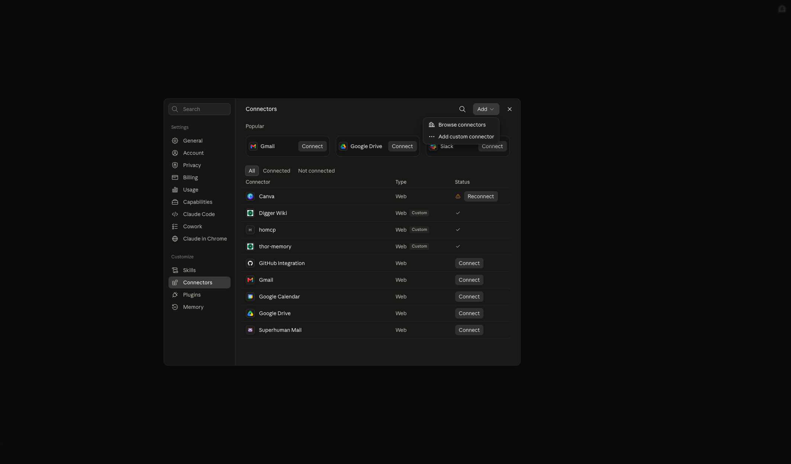

2. Name + the `/mcp` URL → Continue.

   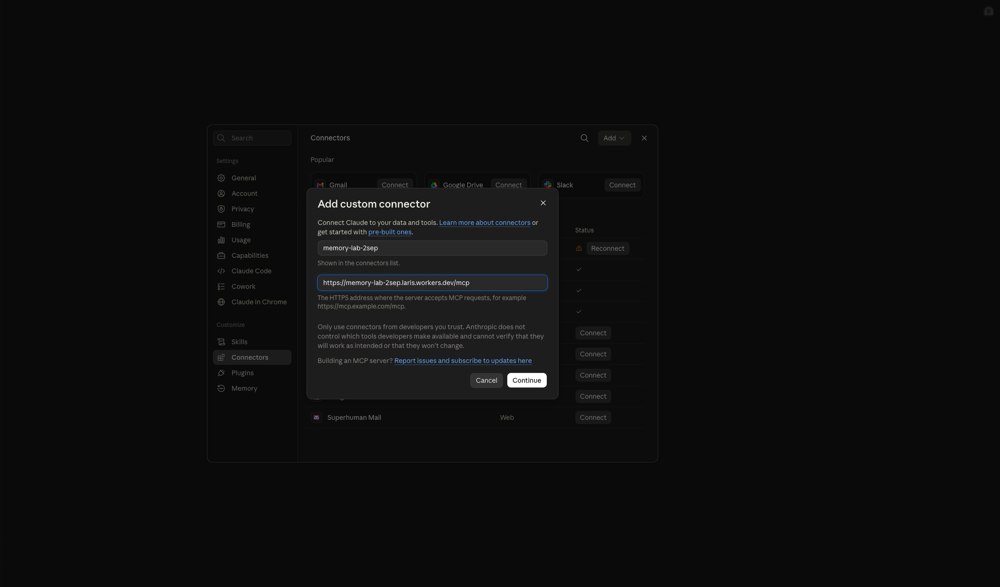

3. claude.ai reads `/.well-known/oauth-protected-resource/mcp` by itself and reports **Authentication: Always required — Detected** and **No client ID — register one automatically (DCR) — Detected**. Two things it offers today that older notes said it could not: *Use Anthropic's hosted client metadata (CIMD)* and **Additional request headers** (up to four static headers sent with every MCP request).

   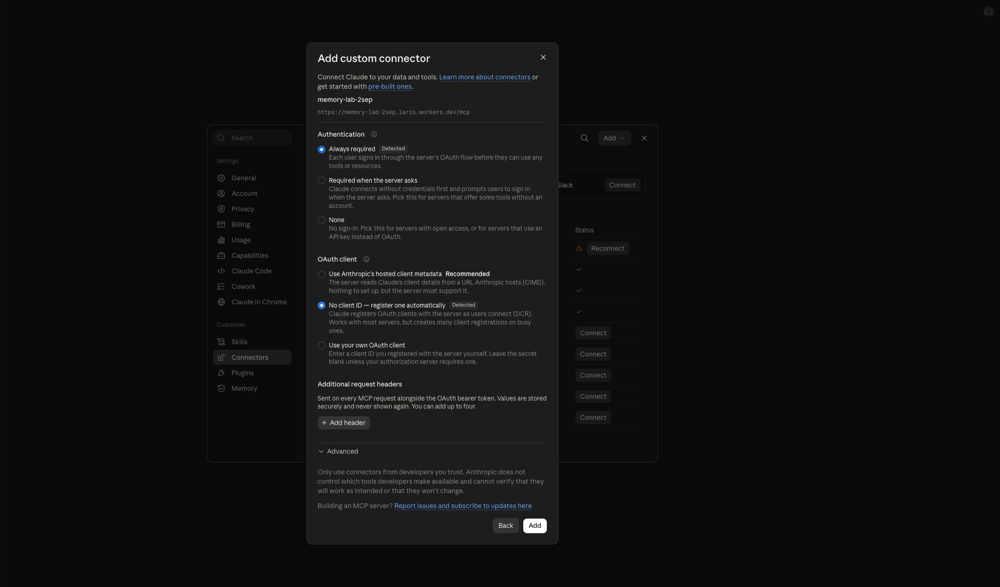

4. **Connect** → this Worker's `/authorize` page opens; it names the client and marks it `claude.ai` because the registered callback is `https://claude.ai/api/mcp/auth_callback`. Enter the owner passphrase.

   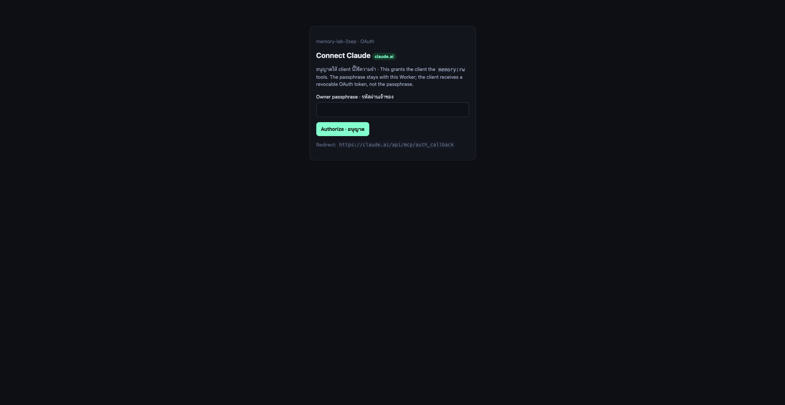

5. Back in claude.ai: **Connected to memory-lab-2sep**, all nine tools listed under read-only / write-delete / other, each with its own permission.

   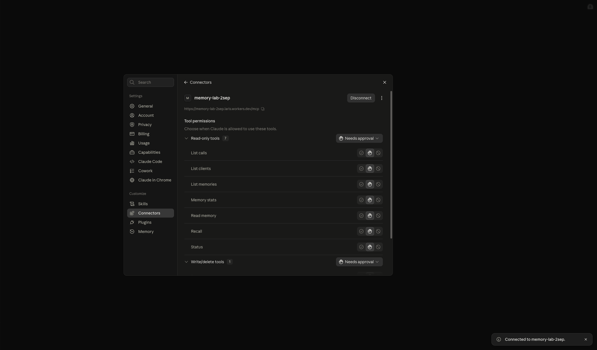
   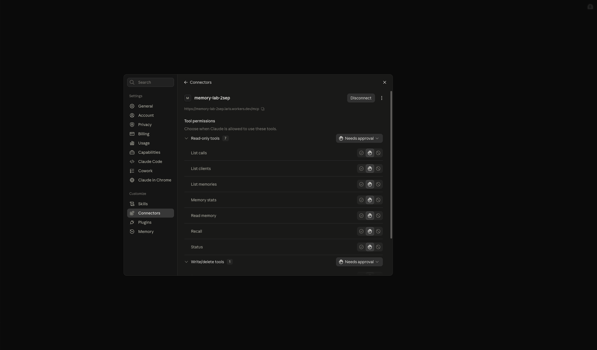

6. In a chat, three real tool calls (`status`, `recall "ความจำ"`, `list_calls`). Claude's own remark, verbatim: *"arriving over OAuth from US/IAD at ~745 ms, versus 36–38 ms for the CLI's api-token calls out of TH/BKK. The log is live and includes the reader."*

   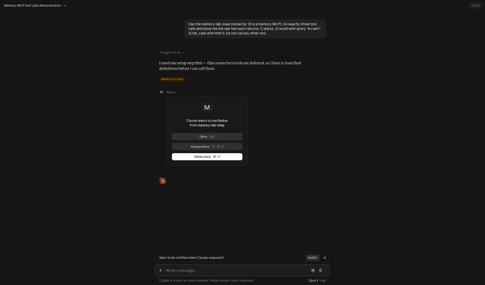
   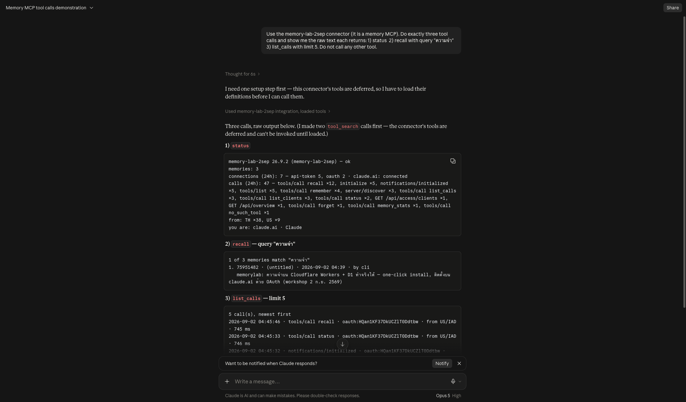

## Install in Claude Code

```bash
# static token (what this machine uses; the ledger names it "token · Claude Code")
claude mcp add --scope user --transport http memory-lab-2sep https://memory-lab-2sep.laris.workers.dev/mcp \
  --header "Authorization: Bearer <API_TOKEN>"
# or OAuth, nothing secret stored
claude mcp add --scope user --transport http memory-lab-2sep https://memory-lab-2sep.laris.workers.dev/mcp
claude mcp login memory-lab-2sep
```

`claude mcp list` → `memory-lab-2sep: … (HTTP) - ✔ Connected`. Claude Code 2.1.258 announces itself as `clientInfo claude-code 2.1.258`, protocol `2025-11-25`.

## The ledger — what the Worker actually saw today

`list_clients` (24 h), verbatim from [`out/ledger-final.log`](out/ledger-final.log):

```
claude.ai · Claude · 12 req / 3 tool calls · clientInfo Anthropic/ClaudeAI 1.0.0 · proto 2025-11-25→2025-11-25 · from US/IAD · last tool list_calls
token · Claude Code · 4 req / 0 tool calls · clientInfo claude-code 2.1.258 · proto 2025-11-25→2025-11-25 · from TH/BKK
token · memory-lab-2sep-cli · 9 req / 7 tool calls · clientInfo memory-lab-2sep-cli 1 · proto 2025-06-18→2025-06-18 · from TH/BKK
OAuth · smoke-test (curl) · 13 req / 9 tool calls · clientInfo smoke-test 1.0 · from TH/BKK
```

`list_calls` — the exact method sequence claude.ai sends when you click **Add** and again on **Connect**:

```
server/discover            ← not an MCP method; answered -32601, logged as such
initialize                 ← protocolVersion 2025-11-25, echoed back
notifications/initialized  ← 202, empty body
tools/list
tools/call status | recall | list_calls   ← ~745 ms each from US/IAD
```

Where the numbers come from: `request.cf.colo` / `country` / `city` / `asOrganization` and `cf-connecting-ip`, written on every request. Nothing stores a credential; an OAuth principal is its `client_id`, a static-token caller is its user-agent family.

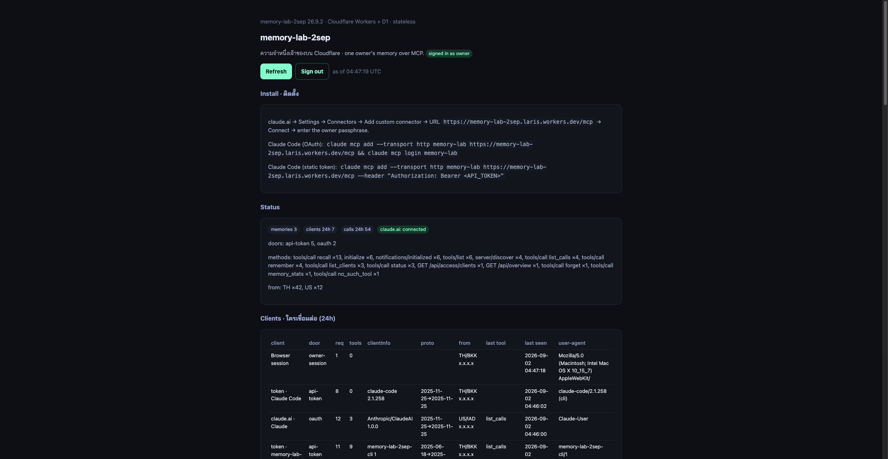

Cloudflare's side of the same thing — the Worker exists, has a D1 binding, and is taking requests:

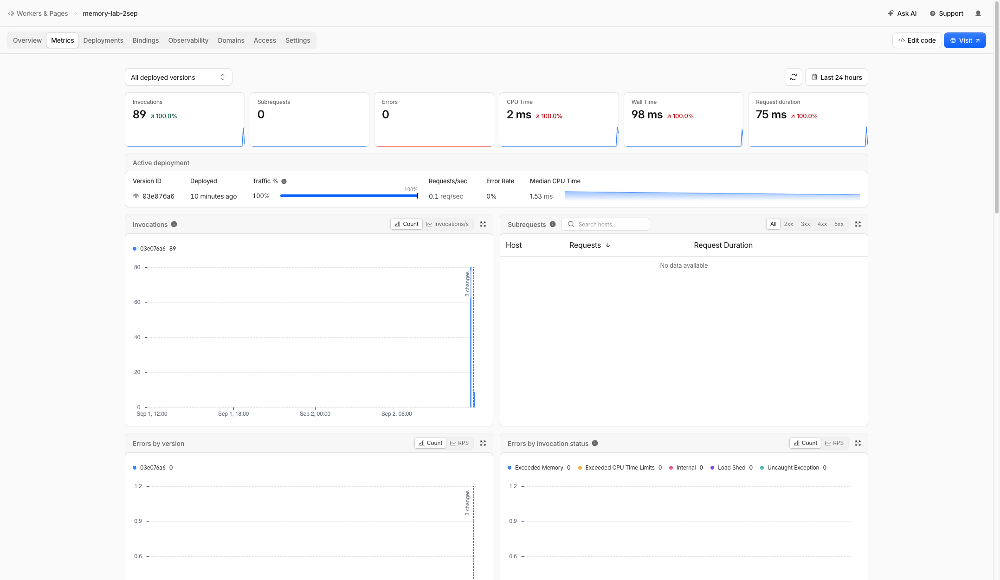

And the D1 database itself — note the region: **Asia Pacific (APAC)**, which is why callers in Bangkok see ~40 ms and claude.ai in Virginia sees ~745 ms for the same code.

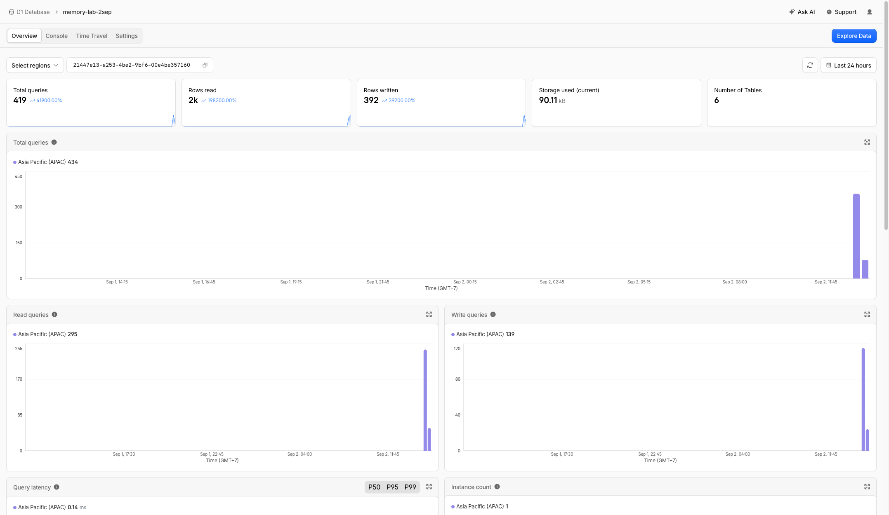

## Run it

```bash
bun install                      # dev deps only: wrangler, typescript, types
just check                       # tsc + 11 unit tests
cp .env.example .dev.vars        # then set OWNER_PASSPHRASE (openssl rand -base64 32) and API_TOKEN
just dev                         # local Worker + local D1 on a free port
just deploy --create             # first deploy: creates D1 by name, deploys
just secrets                     # uploads the two secrets from your environment
just smoke                       # the whole client walk against the live Worker
just demo                        # check → deploy → health → smoke → mcp → dig → ledger → backup → restore
```

Every step of `just demo` is its own recipe and prints real output. Today's full run ([`out/demo.log`](out/demo.log)): **exit 0 in 42 s** — tests 11 pass, deploy, health, smoke ALL PASS, Thai recall 1 of 3, dig 3 memories, ledger, backup 101 rows → restore `memories 3 · clients 9 · calls 82` equal on both sides.

## Report — measured 2026-09-02 (Asia/Bangkok)

Everything below came out of the recipes in `justfile` today; raw logs in [`out/`](out/). The full run `just demo` finished **exit 0 in 42 s** ([`out/demo.log`](out/demo.log)).

### Build

| item | value |
|---|---|
| runtime | Cloudflare Worker, one D1 binding, no KV, no Durable Object |
| runtime dependencies | **0** (dev: wrangler 4.125.0, typescript 6.0.3) |
| source | 1,656 lines TypeScript + 90 lines tests; 11 tests pass; `tsc` clean |
| bundle | 60.97 KiB (17.25 KiB gzip); startup 5 ms; deploy ≈3 s |
| Cloudflare metrics (11:47) | 89 invocations, 0 errors, CPU p50 2 ms, wall 98 ms, request duration 75 ms |
| D1 | region **Asia Pacific (APAC)**, 6 tables, 90 kB, 419 queries today |

### The loop a client walks (`out/smoke-remote-1137.log`, from Bangkok, colo BKK)

| step | result | ms |
|---|---|---|
| GET /api/health | `ok` | 270 (cold) |
| discovery: protected resource · authorization server | `resource=…/mcp` · PKCE `S256` | 199 · 86 |
| POST /mcp without token | 401 + `WWW-Authenticate … resource_metadata=…` | 178 |
| DCR `POST /oauth/register` | 201 | 203 |
| GET /authorize | approval page | 146 |
| POST /authorize wrong passphrase | 401, no redirect | 139 |
| POST /authorize right passphrase | 302 → `redirect_uri?code=…&state=…` | 198 |
| POST /oauth/token (PKCE) | `access_token`, 30 days, scope `memory:rw` | 286 |
| replay the code | 400 `invalid_grant` | 166 |
| MCP `initialize` (`Accept: text/event-stream`) | SSE frame, protocol `2025-11-25` echoed | 153 |
| `notifications/initialized` | 202 empty | 152 |
| `tools/list` | 9 tools | 189 |
| `remember` (Thai content) | id `4d6375f4` | 198 |
| `recall "ความจำ"` | **1 of 1**, matched inside `ความจำบน…` | 303 |
| `recall "CLOUDFLARE workers"` | hit, case-insensitive | 191 |
| recall miss | 0 hits, not an error | 311 |
| `list_clients` · `list_calls` · `status` | ledger rows | 183 · 236 · 244 |
| unknown tool | `isError` inside a 200 result | 151 |
| `forget` | cleaned up | 213 |
| static `API_TOKEN` door | `memory_stats` | 105 |

`POST /mcp` from Bangkok: n=14, **min 105 · median 191 · max 311 ms**. Same 24 steps on `wrangler dev --local`: median **11 ms**.

### Approach × Thai recall × latency × restore

| approach | Thai recall (`ความจำ`) | latency (today) | restore |
|---|---|---|---|
| **this** — Workers + D1, substring | 1/1 in smoke, 1/3 on the seeded corpus; mid-word, no tokenizer | MCP median 191 ms from BKK; 33–51 ms server-side from BKK callers; **745–761 ms** from claude.ai (IAD) | `d1 export` 46 rows / 17 KB in 7.5 s → local D1 10.5 s; counts equal |
| arra-memory-lab — Workers + D1 + Workers AI | keyword `LIKE` + 768-d embeddings (not re-measured) | `GET /api/info` 72 / 135 / 242 ms | `d1 export` |
| digger-wiki-haos — HAOS add-on + tunnel | trigram FTS + Thai vector space (5 Thai-majority chunks of 2,787) | `GET /api/health` 203 / 206 / 204 ms | HA backup of `/data` |
| arra-memory / thor-memory — HAOS add-on | keyword-only while the embedding host is down (1 Sep) | **not measured — production, off-limits** | HA backup of `/data` |
| session-lance-mcp — local LanceDB + Apple NL | ngram-3 FTS + Thai model (4,148 Thai vectors of 56,600) | local stdio; index 1,729 s for 56,710 docs | copy `db/*.lance` |

### What claude.ai sends (`out/ledger-final.log`)

| time (UTC) | method | from | server-side ms |
|---|---|---|---|
| 04:43:50 | `server/discover` | US/IAD | 494 — not an MCP method, answered `-32601` |
| 04:43:50 | `initialize` | US/IAD | 483 |
| 04:43:51 | `notifications/initialized` | US/IAD | 501 |
| 04:43:52 | `tools/list` | US/IAD | 468 |
| 04:43:54–56 | the same four again on **Connect** | US/IAD | 482–494 |
| 04:45:33 | `tools/call status` | US/IAD | 746 |
| 04:45:46 | `tools/call recall` (`ความจำ`) | US/IAD | 745 |
| 04:46:00 | `tools/call list_calls` | US/IAD | 761 |

Claude Code 2.1.258 sends the same `server/discover` probe before `initialize`.

**Finding — where the data lives decides the latency.** The Worker runs in the caller's colo; D1 is single-region and was placed in APAC on first use. Each request makes 3–4 sequential D1 queries (bearer lookup, client label, the tool; the ledger write is async). From BKK that is 33–51 ms server-side; from IAD 468–761 ms. Same code, ~15× slower across the Pacific. Follow-ups: D1 read replication (Sessions API), or cache the bearer per isolate.

### Digger fan-out (`out/dig-*.log`)

| query | variants | calls | ms | found | by the literal query alone |
|---|---|---|---|---|---|
| `teamcharter` | `teamcharter`, `team charter`, `charter`, `team` | 4 | 615 | 2 | 1 |
| `memorylab` | `memorylab`, `memory lab`, `memory`, `lab` | 4 | 486 | 3 | 1 |

Same lesson as lab 02 on thor-memory (1 Sep: `teamcharter` 0, `team charter` 3): the split finds what the compound cannot.

### Backup → restore

```
just backup   d1 export --remote → backup/<stamp>.sql   46 rows (101 by 11:51), 7.5 s
just restore  local D1  {'memories': 3, 'clients': 5, 'calls': 35}
              remote D1 {'memories': 3, 'clients': 5, 'calls': 35}   10.5 s
```

The restore target is the local D1 on purpose: no demo recipe ever drops the live database.

### claude.ai, verified

- Step 2 of *Add custom connector* detected the discovery documents by itself: *Always required — Detected*, *No client ID — register one automatically — Detected*.
- claude.ai registered client `Claude` with callback `https://claude.ai/api/mcp/auth_callback`, walked `/authorize` (owner passphrase) → `/oauth/token` (PKCE S256), then **Connected to memory-lab-2sep** with nine tools grouped read-only / write-delete / other.
- In a chat (Opus 5) it ran `tool_search` twice first (connector tools are *deferred*), then `status`, `recall`, `list_calls` after one permission prompt each, and quoted the ledger back: *"~745 ms … versus 36–38 ms for the CLI's api-token calls out of TH/BKK. The log is live and includes the reader."*
- New in the connector form today: **Additional request headers** (up to four, sent with every MCP request) and **CIMD** as an alternative to DCR. Older notes that say claude.ai cannot send a static header are out of date.

## Five approaches, side by side

| | **this** (Workers + D1) | arra-memory-lab (Workers + D1 + AI) | digger-wiki (HAOS add-on) | arra-memory / thor-memory (HAOS add-on) | session-lance-mcp (local LanceDB) |
|---|---|---|---|---|---|
| remembers | owner's notes, 12 kB each | notes + 768-d embeddings + observations | ψ/ralph wiki, 202 pages baked | oracle memories, libSQL | 56,710 session docs, 512-d Apple NL vectors |
| lives in | D1 (one region) | D1 + KV + Workers AI | SQLite + a Python LanceDB sidecar on a home Home Assistant box | libSQL file under `/data` | `db/*.lance` on the Mac |
| install | Deploy button (public repo) or `just deploy` | Deploy button | HA add-on repo, 5 manual steps + tunnel | HA add-on repo | `just index-live` + `claude mcp add` (stdio) |
| claude.ai | OAuth DCR + PKCE, **verified today** | OAuth via workers-oauth-provider, verified 2026-08-23 | OAuth, verified | OAuth (thor-oauth) | no (local stdio) |
| tracks clients | `clients` + `calls` per request, stateless | `search_traces` metadata only, no client identity | `connections` ledger + HA sensor, in-memory batch flush | `list_agents` (who wrote), opt-in search log | none |
| Thai | substring, mid-word | keyword LIKE + embeddings | trigram FTS + Thai vector space | keyword (embedding host down 1 Sep) | ngram-3 FTS + Thai model |
| latency seen today | health 106–138 ms (BKK) | health 72–242 ms (BKK) | health 203 ms (BKK → tunnel) | not measured (production, off-limits) | local |
| restore | `wrangler d1 export/execute`, verified | `d1 export` | HA backup of `/data` | HA backup of `/data` | copy `db/` dir |

## Boundaries this lab kept

- **Production memory databases** (`thor-memory`, `arra`) were never touched — not even their health endpoints. Their column in the side-by-side uses documented numbers, and says so.
- **Before publishing**, a five-lens audit with adversarial verification went over every tracked file, the whole git history, and every screenshot. What it changed: the claude.ai sidebar cropped out of seven captures, unreferenced and duplicate images deleted, absolute paths and the developer's username scrubbed from `out/*.log`, OAuth client ids truncated to the 8-character prefix the ledger's own policy states, a private home-lab hostname replaced, dashboard IP addresses masked, `LICENSE` and `SECURITY.md` added. The branch was then rebuilt as a single commit so no pre-scrub blob exists in history.
- **Your own deployment** gets its own D1 and its own secrets. See [SECURITY.md](SECURITY.md) for what must never be committed — in particular `backup/*.sql`, which contains live OAuth tokens.

## Learned from

`ψ/lab/02-arra-memory-digger` (fan-out digger, 1 Sep), `ψ/lab/05-session-lance-mcp` (protocol negotiation, SSE frames), `digger-wiki-haos` (connections ledger, hand-rolled OAuth + JSON-RPC), `arra-memory-lab` (Deploy button, placeholder-id deploy script). Their measured traps are cited inline in the source.
